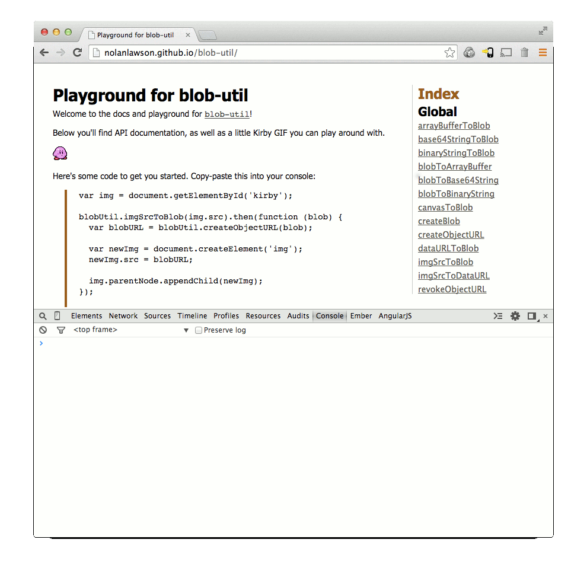

blob-util [](https://travis-ci.org/nolanlawson/blob-util)
=====

`blob-util` is a [Blob](https://developer.mozilla.org/en-US/docs/Web/API/Blob?redirectlocale=en-US&redirectslug=DOM%2FBlob) library for busy people.

It offers a tiny (~3.5KB min+gz) set of cross-browser utilities for translating Blobs to and from different formats:

* `` tags
* base 64 strings
* binary strings
* ArrayBuffers
* data URLs
* canvas

It's also a good pairing with the attachment API in [PouchDB](http://pouchdb.com).

**Note**: this is a browser library. For Node.js, see [Buffers](http://nodejs.org/api/buffer.html).

**Topics**:

* [Install](#usage)
* [Browser support](#browser-support)
* [Tutorial](#tutorial)
* [Playground](http://nolanlawson.github.io/blob-util)
* [API](#api)

Install
------

Download it from the `dist/` folder above, or use NPM:

```bash
$ npm install blob-util
```

or Bower:

```bash
$ bower install blob-util
```

Then stick it in your HTML:

```html
<script src="blob-util.js"></script>
```

Now you have a `window.blobUtil` object. Or if you don't like globals, you can use Browserify.

Browser support
-----

* Firefox
* Chrome
* IE 10+
* Safari 6+
* iOS 6+
* Android 4.4+
* Any browser with either `Blob` or the older `BlobBuilder`; see [caniuse](http://caniuse.com/#search=blob) for details.

Tutorial
--------

Blobs (<strong>b</strong>inary <strong>l</strong>arge <strong>ob</strong>jects) are the modern way of working with binary data in the browser. The browser support is [very good](http://caniuse.com/#search=blob).

Once you have a Blob, you can make it available offline by storing it in [IndexedDB](http://www.w3.org/TR/IndexedDB/), [PouchDB](http://pouchdb.com/), [LocalForage](https://mozilla.github.io/localForage/), or other in-browser databases. So it's the perfect format for working with offline images, sound, and video.

A [File](https://developer.mozilla.org/en-US/docs/Web/API/File) is also a Blob. So if you have an `<input type="file">` in your page, you can let your users upload any file and then work with it as a Blob.

### Example

Here's Kirby. He's a famous little Blob.


So let's fulfill his destiny, and convert him to a real `Blob` object.

```js
var img = document.getElementById('kirby');

blobUtil.imgSrcToBlob(img.src).then(function (blob) {
  // ladies and gents, we have a blob
}).catch(function (err) {
  // image failed to load
});
```

(Don't worry, this won't download the image twice, because browsers are smart.)

Now that we have a `Blob`, we can convert it to a URL and use that as the source for another `` tag:

```js
var blobURL = blobUtil.createObjectURL(blob);

var newImg = document.createElement('img');
newImg.src = blobURL;

document.body.appendChild(newImg);
```

So now we have two Kirbys - one with a normal URL, and the other with a blob URL. You can try this out yourself in the [blob-util playground](http://nolanlawson.github.io/blob-util). Super fun!




API
-------

Warning: this API uses [Promises](https://promisesaplus.com/), because it's not 2009 anymore.

###Overview

* [createBlob(parts, options)](#createBlob)
* [createObjectURL(blob)](#createObjectURL)
* [revokeObjectURL(url)](#revokeObjectURL)
* [blobToBinaryString(blob)](#blobToBinaryString)
* [base64StringToBlob(base64, type)](#base64StringToBlob)
* [binaryStringToBlob(binary, type)](#binaryStringToBlob)
* [blobToBase64String(blob)](#blobToBase64String)
* [dataURLToBlob(dataURL)](#dataURLToBlob)
* [imgSrcToDataURL(src, type, crossOrigin, quality)](#imgSrcToDataURL)
* [canvasToBlob(canvas, type, quality)](#canvasToBlob)
* [imgSrcToBlob(src, type, crossOrigin, quality)](#imgSrcToBlob)
* [arrayBufferToBlob(buffer, type)](#arrayBufferToBlob)
* [blobToArrayBuffer(blob)](#blobToArrayBuffer)
 
<a name="createBlob"></a>
###createBlob(parts, options)
Shim for
[new Blob()](https://developer.mozilla.org/en-US/docs/Web/API/Blob.Blob)
to support
[older browsers that use the deprecated <code>BlobBuilder</code> API](http://caniuse.com/blob).

**Params**

- parts `Array` - content of the <code>Blob</code>  
- options `Object` - usually just <code>{type: myContentType}</code>  

**Returns**: `Blob`  

**Example**:

```js
var myBlob = blobUtil.createBlob(['hello world'], {type: 'text/plain'});
```

<a name="createObjectURL"></a>
###createObjectURL(blob)
Shim for
[URL.createObjectURL()](https://developer.mozilla.org/en-US/docs/Web/API/URL.createObjectURL)
to support browsers that only have the prefixed
<code>webkitURL</code> (e.g. Android <4.4).

**Params**

- blob `Blob`  

**Returns**: `string` - url  

**Example**:

```js
var myUrl = blobUtil.createObjectURL(blob);
```

<a name="revokeObjectURL"></a>
###revokeObjectURL(url)
Shim for
[URL.revokeObjectURL()](https://developer.mozilla.org/en-US/docs/Web/API/URL.revokeObjectURL)
to support browsers that only have the prefixed
<code>webkitURL</code> (e.g. Android <4.4).

**Params**

- url `string`  

**Example**:

```js
blobUtil.revokeObjectURL(myUrl);
```

<a name="blobToBinaryString"></a>
###blobToBinaryString(blob)
Convert a <code>Blob</code> to a binary string. Returns a Promise.

**Params**

- blob `Blob`  

**Returns**: `Promise` - Promise that resolves with the binary string 

**Example**:

```js
blobUtil.blobToBinaryString(blob).then(function (binaryString) {
  // success
}).catch(function (err) {
  // error
});
```
 
<a name="base64StringToBlob"></a>
###base64StringToBlob(base64, type)
Convert a base64-encoded string to a <code>Blob</code>. Returns a Promise.

**Params**

- base64 `string`  
- type `string` | `undefined` - the content type (optional)  

**Returns**: `Promise` - Promise that resolves with the <code>Blob</code>  

**Example**:

```js
blobUtil.base64StringToBlob(base64String).then(function (blob) {
  // success
}).catch(function (err) {
  // error
});
```

<a name="binaryStringToBlob"></a>
###binaryStringToBlob(binary, type)
Convert a binary string to a <code>Blob</code>. Returns a Promise.

**Params**

- binary `string`  
- type `string` | `undefined` - the content type (optional)  

**Returns**: `Promise` - Promise that resolves with the <code>Blob</code>  

**Example**:

```js
blobUtil.binaryStringToBlob(binaryString).then(function (blob) {
  // success
}).catch(function (err) {
  // error
});
```

<a name="blobToBase64String"></a>
###blobToBase64String(blob)
Convert a <code>Blob</code> to a binary string. Returns a Promise.

**Params**

- blob `Blob`  

**Returns**: `Promise` - Promise that resolves with the binary string  


**Example**:

```js
blobUtil.blobToBase64String(blob).then(function (base64String) {
  // success
}).catch(function (err) {
  // error
});
```

<a name="dataURLToBlob"></a>
###dataURLToBlob(dataURL)
Convert a data URL string
(e.g. <code>'data:image/png;base64,iVBORw0KG...'</code>)
to a <code>Blob</code>. Returns a Promise.

**Params**

- dataURL `string`  

**Returns**: `Promise` - Promise that resolves with the <code>Blob</code>  

**Example**:

```js
blobUtil.dataURLToBlob(dataURL).then(function (blob) {
  // success
}).catch(function (err) {
  // error
});
```

<a name="imgSrcToDataURL"></a>
###imgSrcToDataURL(src, type, crossOrigin, quality)
Convert an image's <code>src</code> URL to a data URL by loading the image and painting
it to a <code>canvas</code>. Returns a Promise.

<p/>Note: this will coerce the image to the desired content type, and it
will only paint the first frame of an animated GIF.

**Params**

- src `string`  
- type `string` | `undefined` - the content type (optional, defaults to 'image/png')  
- crossOrigin `string` | `undefined` - for CORS-enabled images, set this to
                                        'Anonymous' to avoid "tainted canvas" errors  
- quality `number` | `undefined` - a number between 0 and 1 indicating image quality
                                    if the requested type is 'image/jpeg' or 'image/webp'  

**Returns**: `Promise` - Promise that resolves with the data URL string  

**Examples**:

```js
blobUtil.imgSrcToDataURL('http://mysite.com/img.png').then(function (dataURL) {
  // success
}).catch(function (err) {
  // error
});
```

```js
blobUtil.imgSrcToDataURL('http://some-other-site.com/img.jpg', 'image/jpeg', 
                         {crossOrigin: 'Anonymous'}).then(function (dataURL) {
  // success
}).catch(function (err) {
  // error
});
```

<a name="canvasToBlob"></a>
###canvasToBlob(canvas, type, quality)
Convert a <code>canvas</code> to a <code>Blob</code>. Returns a Promise.

**Params**

- canvas `string`  
- type `string` | `undefined` - the content type (optional, defaults to 'image/png')  
- quality `number` | `undefined` - a number between 0 and 1 indicating image quality
                                    if the requested type is 'image/jpeg' or 'image/webp'  

**Returns**: `Promise` - Promise that resolves with the <code>Blob</code>  


**Examples**:

```js
blobUtil.canvasToBlob(canvas).then(function (blob) {
  // success
}).catch(function (err) {
  // error
});
```

Most browsers support converting a canvas to both `'image/png'` and `'image/jpeg'`. You may
also want to try `'image/webp'`, which will work in some browsers like Chrome (and in other browsers, will just fall back to `'image/png'`):

```js
blobUtil.canvasToBlob(canvas, 'image/webp').then(function (blob) {
  // success
}).catch(function (err) {
  // error
});
```

<a name="imgSrcToBlob"></a>
###imgSrcToBlob(src, type, crossOrigin, quality)
Convert an image's <code>src</code> URL to a <code>Blob</code> by loading the image and painting
it to a <code>canvas</code>. Returns a Promise.

<p/>Note: this will coerce the image to the desired content type, and it
will only paint the first frame of an animated GIF.

**Params**

- src `string`  
- type `string` | `undefined` - the content type (optional, defaults to 'image/png')  
- crossOrigin `string` | `undefined` - for CORS-enabled images, set this to
                                        'Anonymous' to avoid "tainted canvas" errors  
- quality `number` | `undefined` - a number between 0 and 1 indicating image quality
                                    if the requested type is 'image/jpeg' or 'image/webp'  

**Returns**: `Promise` - Promise that resolves with the <code>Blob</code>  

**Examples**:

```js
blobUtil.imgSrcToBlob('http://mysite.com/img.png').then(function (blob) {
  // success
}).catch(function (err) {
  // error
});
```

```js
blobUtil.imgSrcToBlob('http://some-other-site.com/img.jpg', 'image/jpeg', 
                         {crossOrigin: 'Anonymous'}).then(function (blob) {
  // success
}).catch(function (err) {
  // error
});
```

<a name="arrayBufferToBlob"></a>
###arrayBufferToBlob(buffer, type)
Convert an <code>ArrayBuffer</code> to a <code>Blob</code>. Returns a Promise.

**Params**

- buffer `ArrayBuffer`  
- type `string` | `undefined` - the content type (optional)  

**Returns**: `Promise` - Promise that resolves with the <code>Blob</code>  

**Example**:

```js
blobUtil.arrayBufferToBlob(arrayBuff, 'audio/mpeg').then(function (blob) {
  // success
}).catch(function (err) {
  // error
});
```

<a name="blobToArrayBuffer"></a>
###blobToArrayBuffer(blob)
Convert a <code>Blob</code> to an <code>ArrayBuffer</code>. Returns a Promise.

**Params**

- blob `Blob`  

**Returns**: `Promise` - Promise that resolves with the <code>ArrayBuffer</code>  

**Example**:

```js
blobUtil.blobToArrayBuffer(blob).then(function (arrayBuff) {
  // success
}).catch(function (err) {
  // error
});
```

Credits
----

Thanks to [webmodules/blob](https://github.com/webmodules/blob) for the Blob constructor shim, and to the rest of [the PouchDB team](https://github.com/pouchdb/pouchdb/graphs/contributors) for figuring most of this crazy stuff out.

Building the library
----

    npm install
    npm run build

To generate documentation in `doc/`:

    npm run jsdoc

or in markdown format as `api.md`

    npm run jsdoc2md

The playground is just `jsdoc` with some extra text containing Kirby and the code samples and such.

So unfortunately you will need to do a manual diff to get the docs up to date. You'll need to diff:

* `api.md` to `README.md`
* `index.html` to `doc/global.html`

Update: I also manually added a bunch of code samples to `README.md` because jsdoc didn't seem to support that. So... yeah, jsdoc might not be so helpful anymore.

Testing the library
----

    npm install

Then to test in the browser using Saucelabs:

    npm test

Or to test locally in your browser of choice:

    npm run test-local

Or to test in PhantomJS:

    npm run test-phantom
